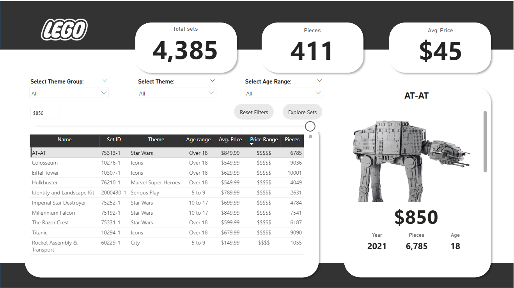
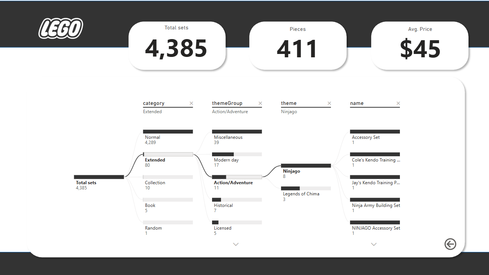

# 🧱 LEGO Set Explorer | Power BI Interactive Dashboard

An interactive Power BI dashboard simulating the experience of an avid LEGO collector exploring over 4,000 LEGO sets to find the perfect next set.

---

## 🔗 Explore the Interactive Dashboard
*(Note: Available as a downloadable .pbix file)*

---

## ✨ Project Overview

This project was completed as part of an advanced Power BI crash course led by Maven Analytics Founder Chris Dutton.  
The dashboard is designed to be highly interactive and visually polished, offering an intuitive way to explore LEGO sets based on key criteria.

---

## 🎯 Key Features

- **Interactive Exploration:** Filter LEGO sets by theme, age range, price, and number of pieces.
- **Custom Image Tooltips:** Hover over a LEGO set name to view a thumbnail image of the box art.
- **Decomposition Tree:** Drill down into total pieces by theme, age range, and year.
- **Numeric Range Parameters:** Dynamically select piece counts or price ranges.
- **Bookmark Actions:** "Reset Filters" button for user-friendly navigation.
- **Page Navigation:** Seamless transitions between pages.
- **Professional UI/UX:** Clean layout with rounded corners, shadows, and smooth slicer experiences.

---

## 📚 Learning Outcomes

- Advanced visual formatting in Power BI (cards, tooltips, buttons)
- Dynamic data interactions through parameters and slicers
- Bookmarking and page navigation techniques
- Use of decomposition trees for ad-hoc data exploration
- Designing a professional, polished report layout

---

## 📂 Project Structure

- **Home Page:** Overview metrics and navigation buttons.
- **Explore Sets:** Filter and analyze sets using interactive slicers and visuals.
- **Set Details Tooltip:** Dynamic thumbnail images shown on hover.
- **Decomposition Tree Page:** Explore sets by themes, years, and age categories.

---

## 🛠️ Tools & Technologies

- Power BI Desktop
- DAX Measures and Calculated Columns

---

## 📸 Quick Preview

### 🧩 Explore Sets Page

### 🌳 Decomposition Tree View

---

## 👥 Acknowledgments

Special thanks to Maven Analytics and Chris Dutton for providing high-quality learning resources and inspiration for this project.

---

## 📅 Project Status

- ✅ Completed and published.
- 🚀 Future enhancements could include dynamic set recommendations based on user-selected criteria.

---

## 🧭 How to Explore

1. Clone or download this repository.
2. Open the `.pbix` file in **Power BI Desktop**.
3. Explore different pages, interact with slicers, and experience dynamic navigation and tooltips.

